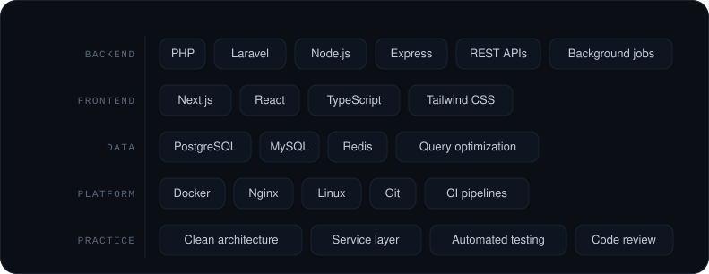
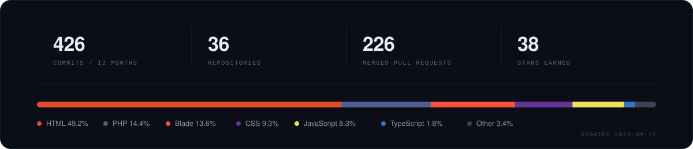

I build web platforms that hold up in production. Most of my work sits on the server side: REST APIs, relational data models, and the unglamorous work of keeping queries fast while the data keeps growing. Laravel and PostgreSQL do the heavy lifting, with Next.js and TypeScript on the interfaces that sit on top of them.

## Stack

## Selected work

<!-- work:start -->
| Project | Focus | What it does | Stack |
| --- | --- | --- | --- |
| **Multi-tenant SaaS kernel** | Entitlements and tenancy | Plan limits and feature access enforced in Postgres with row-level security, not in application code. | TypeScript · PostgreSQL · Drizzle |
| **Hajez** | Booking marketplace | Resort and chalet reservations where availability, pricing and payment state never drift apart. | Node.js · Express · Next.js |
| **abjd.store** | Production e-commerce | Storefront and API under live traffic, with the heaviest catalog and checkout queries rewritten. [Live](https://abjd.store) | Laravel · PHP · MySQL |
| **Smart customer support system** | Assisted ticket triage | Cuts first-response time by routing and summarising incoming tickets before an agent opens them. | Laravel · PostgreSQL · Next.js |
| **Lead qualification platform** | Sales intelligence | Scores inbound leads so the sales team spends its hours on the prospects that actually convert. | Laravel · MySQL · React |
| **School management platform** | Operations for 176 students | Attendance, records and parent communication on one relational schema with role-based access. | Laravel · MySQL · Blade |
| **Enterprise operations portal** | Workflow and approvals | Multi-level approvals with a full audit trail from submission to final sign-off. | Laravel · PostgreSQL · Docker |
<!-- work:end -->

## How I work

Schema first. Constraints and migrations enforce the rules, not application code that hopes for the best.

Read the query plan before blaming the framework. Most slow endpoints are a missing index or an N+1, not a language problem.

Ship small and reversible. Every migration has a way back, and every release stays small enough to reason about at 2 a.m.

## Activity

## Recent activity

<!-- activity:start -->
_Activity feed renders once the workflow runs._
<!-- activity:end -->
